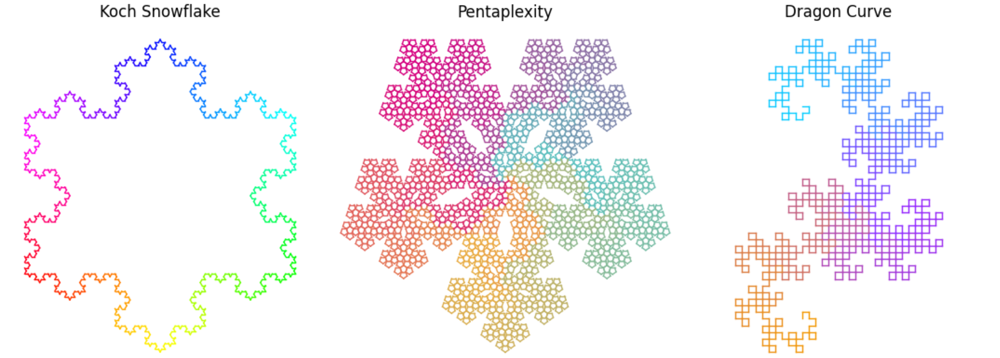
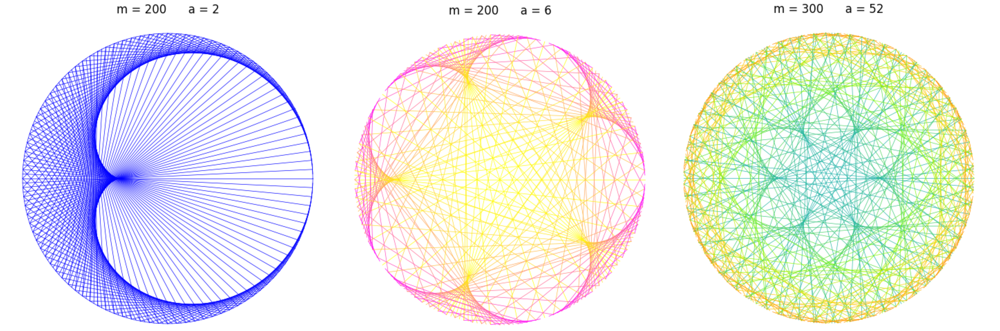
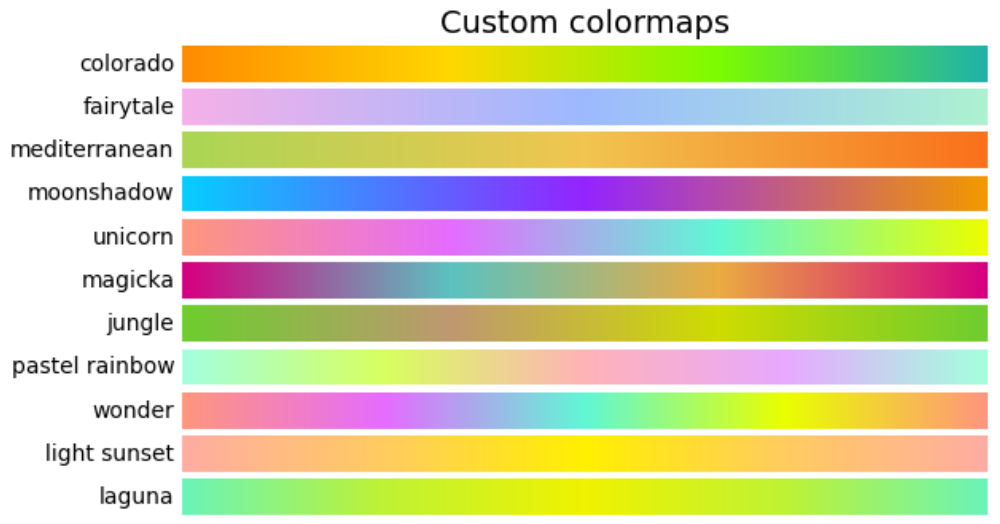

# Fractals and Times Tables Visualization

This repository contains Jupyter notebooks for visualizing fractals and modular times tables using Matplotlib/Pyplot, along with custom color maps for enhanced visual representation.

## Contents

- `fractals.ipynb`: A notebook dedicated to drawing various fractals using L-systems. It includes interactive widgets for customizing the fractal parameters such as the axiom, rules, turning angle, and more. 

- `times_tables.ipynb`: This notebook visualizes modular times tables as intricate patterns on a circle. It features interactive controls for adjusting parameters like the modulus, multiplier, and coloring options. 

- `custom_cmaps.py`: A Python file defining custom sequential and cyclic color maps used in the notebooks for drawing fractals and times tables.

## Requirements

 The following libraries are required to run these notebooks:

- Matplotlib
- NumPy
- ipywidgets
- IPython

To install these dependencies, run `pip install matplotlib numpy ipywidgets IPython`.
